# NotepadMaster - 安卓笔记应用

NotepadMaster 是一款基于 Google Notepad Master 开发的安卓笔记应用，旨在帮助用户高效管理个人笔记。应用主要提供了笔记的基本管理功能，包括记录笔记时间戳、搜索功能、笔记分类和标签管理等，便于用户查看历史记录并快速定位需要的信息。

## 功能模块

### 基础功能

#### 笔记显示时间戳
每个笔记在创建或编辑时都会自动记录时间，并在笔记列表中展示，帮助用户追踪笔记的创建和更新信息。

#### 搜索笔记功能
提供搜索功能，支持根据标题进行笔记的搜索，方便快捷。

### 附加功能

#### 笔记 UI 美化
替换原始 UI，采用简洁清晰的搭配方式，让人有更好的交互体验。

#### 笔记导出功能
用户可以选择导出笔记到本地，便于备份和使用。

#### 偏好设置
可以在主界面选择背景设置，根据个人喜好选择各种合适的背景。在笔记编辑界面可以自定义背景的颜色，以及笔记的字体样式。

#### 字数显示
可以随时显示正在编辑笔记的总字数。

## 功能实现

### 笔记显示时间戳
在`notelist_item.xml`中添加时间戳的显示位置

```xml
<TextView
            android:id="@+id/timetext"
            android:layout_width="wrap_content"
            android:layout_height="wrap_content"
            android:layout_gravity="bottom"
            android:background="#D8D8D8"
            android:gravity="right"
            android:text="timecurrent"
            android:textColor="#6F6F6F"
            tools:ignore="MissingConstraints" />
```

在`NotesList.java`中完成时间戳的显示，要求：在数据库查询时，新增对修改时间字段的读取，确保获取每条笔记的时间戳信息。

添加查询投影
在 PROJECTION 数组中加入时间戳字段：

```java
private static final String[] PROJECTION = new String[] {
         NotePad.Notes._ID, // 0
         NotePad.Notes.COLUMN_NAME_TITLE, // 1
         NotePad.Notes.COLUMN_NAME_MODIFICATION_DATE,
         NotePad.Notes.COLUMN_NAME_NOTE
 };
```

获取时间戳并格式化
在适当的位置添加以下代码：

```java
    long timestamp = cursor.getLong(cursor.getColumnIndex(NotePad.Notes.COLUMN_NAME_MODIFICATION_DATE));
    SimpleDateFormat dateFormat = new SimpleDateFormat("yyyy-MM-dd HH:mm:ss", Locale.getDefault());
    String formattedDate = dateFormat.format(new Date(timestamp));
    TextView timeTextView = (TextView) view.findViewById(R.id.time_text);
    timeTextView.setText(formattedDate);
```

右下角显示笔记更新时间，并且根据更新时间来对笔记列表进行排列，便于用户方便快捷地了解笔记的相关信息。


### 搜索笔记功能

首先在`home.xml`中添加搜索框的显示，我采用了一个`imagebutton`作为搜索按钮，点击以后显示`edittext`作为搜索框

搜索按钮

```xml
        <ImageButton
            android:id="@+id/searchbtn"
            android:layout_width="0dp"
            android:layout_height="match_parent"
            android:layout_gravity="center"
            android:layout_weight="1"
            android:contentDescription="@null"
            android:background="@android:color/transparent"
            android:scaleType="centerInside"
            android:src="@drawable/search_gray" />
```

搜索框，通过`android:visibility="gone"`初始设置为隐藏

```xml
        <EditText
            android:id="@+id/search"
            android:layout_width="350dp"
            android:layout_height="match_parent"
            android:layout_weight="1"
            android:hint="请输入搜索内容"
            android:padding="10dp"
            android:visibility="gone" />
```

再添加一个搜索框返回的按钮

```xml
        <ImageButton
            android:id="@+id/searchBackBtn"
            android:layout_width="30dp"
            android:layout_height="wrap_content"
            android:layout_gravity="center"
            android:layout_weight="1"
            android:contentDescription="@null"
            android:background="@android:color/transparent"
            android:scaleType="centerInside"
            android:src="@drawable/back"
            android:visibility="gone" />
```

在`NotesList.java`添加组件的初始化，后续类似的初始化不再赘述

```java
        final ImageButton searchButton = (ImageButton) findViewById(R.id.searchbtn);
        final TextView searchEditText = (TextView) findViewById(R.id.search);
        final ImageButton closeSearchButton = (ImageButton) findViewById(R.id.searchBackBtn);
```

点击搜索按钮，显示输入框

```java
        searchButton.setOnClickListener(new View.OnClickListener() {
            @Override
            public void onClick(View v) {
                searchEditText.setVisibility(View.VISIBLE);  // 显示输入框
                closeSearchButton.setVisibility(View.VISIBLE);
                findViewById(R.id.title).setVisibility(View.GONE);
                anb.setVisibility(View.GONE);
                searchButton.setVisibility(View.GONE);     // 隐藏搜索按钮
            }
        });
```

点击关闭按钮，隐藏输入框并恢复搜索按钮

```java
closeSearchButton.setOnClickListener(new View.OnClickListener() {
            @Override
            public void onClick(View v) {
                searchEditText.setVisibility(View.GONE);  // 隐藏输入框
                closeSearchButton.setVisibility(View.GONE);
                findViewById(R.id.title).setVisibility(View.VISIBLE);
                anb.setVisibility(View.VISIBLE);
                searchButton.setVisibility(View.VISIBLE);  // 恢复搜索按钮
            }
        });
```

设置输入框内容变化时进行搜索

```java
searchEditText.addTextChangedListener(new TextWatcher() {
            @Override
            public void beforeTextChanged(CharSequence charSequence, int start, int count, int after) {}

            @Override
            public void onTextChanged(CharSequence charSequence, int start, int before, int count) {
                // 当输入框内容发生变化时，进行搜索
                String query = searchEditText.getText().toString();
                performSearch(query);  // 调用搜索功能
            }

            @Override
            public void afterTextChanged(Editable editable) {}
        });
```

搜索功能实现

```java
    private void performSearch(String query) {
        Cursor cursor = managedQuery(
                NotePad.Notes.CONTENT_URI,
                PROJECTION,
                NotePad.Notes.COLUMN_NAME_TITLE + " LIKE ?",
                new String[]{"%" + query + "%"},
                NotePad.Notes.DEFAULT_SORT_ORDER
        );

        SimpleCursorAdapter adapter = (SimpleCursorAdapter) getListAdapter();
        adapter.changeCursor(cursor);
    }
```


点击搜索按钮，跳出搜索框，根据输入在内容中模糊查找相应的笔记。


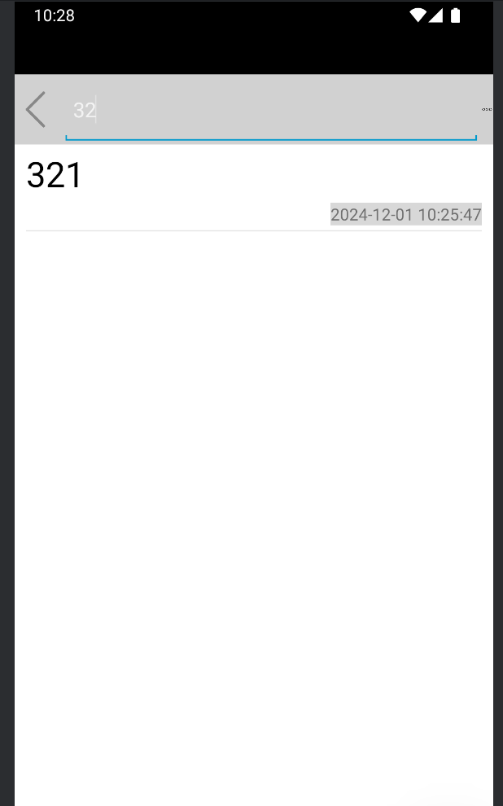

# 笔记 UI 美化

包含以下内容

## 组件美化
## 笔记背景颜色切换
## 字体样式切换
## 主页风格切换
## 字数显示

**组件美化**

旨在提升用户的视觉体验和交互感受。通过重新设计界面风格，去除了原始界面中繁杂、不直观的交互组件，用更简洁、清晰的设计取而代之。这不仅让界面更加美观，还能使用户操作更加流畅、直观。

包含以下方面

**整体配色优化**
应用采用了更加柔和的配色方案，减少了视觉疲劳，让用户在长时间使用过程中保持良好的体验。标题、按钮、背景等元素的颜色搭配更加和谐统一，提升了界面的整体美感。

**布局调整**
优化了界面布局，减少了冗余空间，使界面内容更加紧凑但不显拥挤。重要信息和操作按钮被放置在显眼、易于点击的位置，进一步提升了易用性。

**组件样式美化**
替换了原有的交互组件样式。例如，按钮从传统的方形边框样式改为圆角或阴影风格，使其更符合现代设计趋势。文本框、图标等元素也经过优化，更加符合用户的审美需求。

**原始 UI**

  

**美化后 UI**

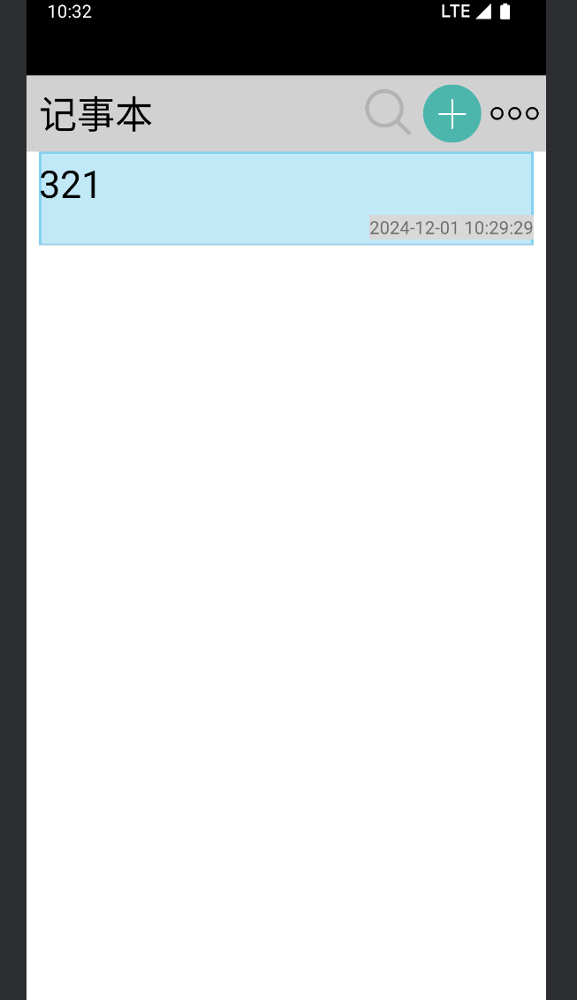

# 笔记背景颜色切换

新建一个`color_menu.xml`来提供背景色的选择，代码过长，这里仅展示其中一部分

白色按钮的展示，其中`chooseicon`是一个标识图片√

```xml
    <ImageButton
            android:id="@+id/colorWhite"
            android:layout_width="60dp"
            android:layout_height="match_parent"
            android:layout_marginEnd="20dp"
            android:layout_gravity="center"
            android:contentDescription="@null"
            android:scaleType="centerInside"
            android:background="@drawable/colorwhite"
            android:src="@drawable/chooseicon" />
```

其余按钮初始无标识，src设为空

```xml
        <ImageButton
            android:id="@+id/colorone"
            android:layout_width="60dp"
            android:layout_height="120dp"
            android:layout_marginEnd="20dp"
            android:contentDescription="@null"
            android:scaleType="centerInside"
            android:layout_gravity="center"
            android:background="@drawable/colorone"
            android:src="@null" />
```

在`note_editor`中添加设置按钮,后续相似处不再展示

```xml
            <ImageButton
                android:id="@+id/setting_one"
                android:layout_width="40dp"
                android:layout_height="match_parent"
                android:layout_gravity="center"
                android:background="@android:color/transparent"
                android:contentDescription="@null"
                android:scaleType="centerInside"
                android:src="@drawable/setting_one" />
```

在`NoteEditor.java`中给设置按钮按钮添加方法，展示`color_menu`菜单

```java
        settingBtn.setOnClickListener(new View.OnClickListener() {
            @Override
            public void onClick(View v) {
                // 显示颜色菜单
                showColorMenu(v);
            }
        });
```

点击其中一个颜色按钮后，通过`.setBackgroundColor()`方法改变背景颜色，代码过长，这里仅展示其中一个按钮的点击事件，其余类似

```java
        // 设置颜色选项的点击事件
        colorWhite.setOnClickListener(new View.OnClickListener() {
            @Override
            public void onClick(View v) {
                findViewById(R.id.note).setBackgroundColor(Color.parseColor("#FFFFFF"));
                colorWhite.setImageResource(R.drawable.chooseicon);
                colorOne.setImageResource(0);
                colorTwo.setImageResource(0);
                colorThree.setImageResource(0);
                colorFour.setImageResource(0);
            }
        });
```

在笔记编辑界面可以选择多种背景颜色。

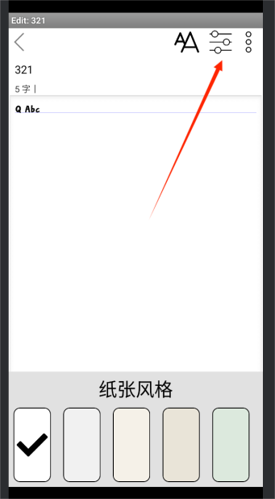
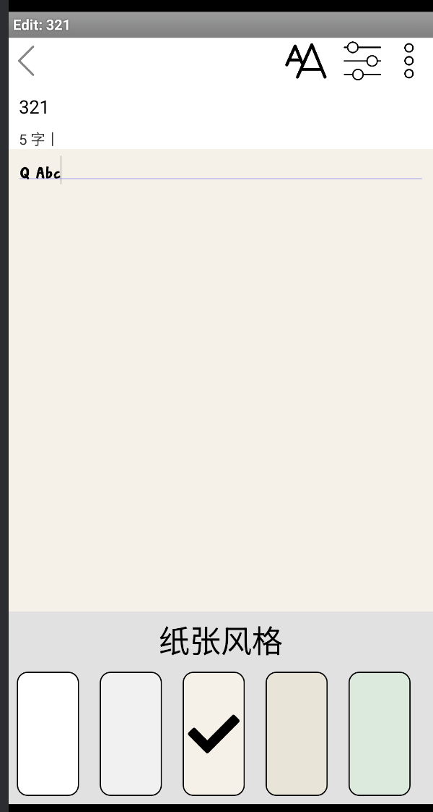
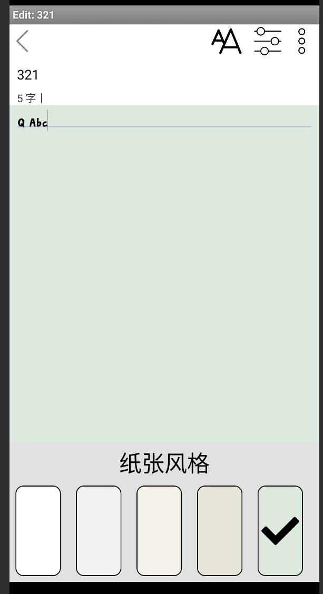

# 主页风格切换

同背景色切换相似，不作过多代码展示

`style_menu`中添加背景选择按钮，其一如下

```xml
    <TextView
        android:id="@+id/bg1Btn"
        android:layout_width="match_parent"
        android:layout_height="wrap_content"
        android:text="红色云纹1" />
```

`NoteList.java`中添加设置按钮的触发

```xml
       ImageButton styleBtn = (ImageButton) findViewById(R.id.styleBtn);

        styleBtn.setOnClickListener(new View.OnClickListener() {
            @Override
            public void onClick(View view) {
                showStyleMenu(view);
            }
        });
```

点击某个按钮后切换背景，只做其一展示，其余不做展示

```java
popupView.findViewById(R.id.bg1Btn).setOnClickListener(new View.OnClickListener() {
            @Override
            public void onClick(View view) {
                findViewById(R.id.bg).setBackgroundResource(R.drawable.bg1);
            }
        });
```

点击右上角选项功能，可以切换多种背景风格。

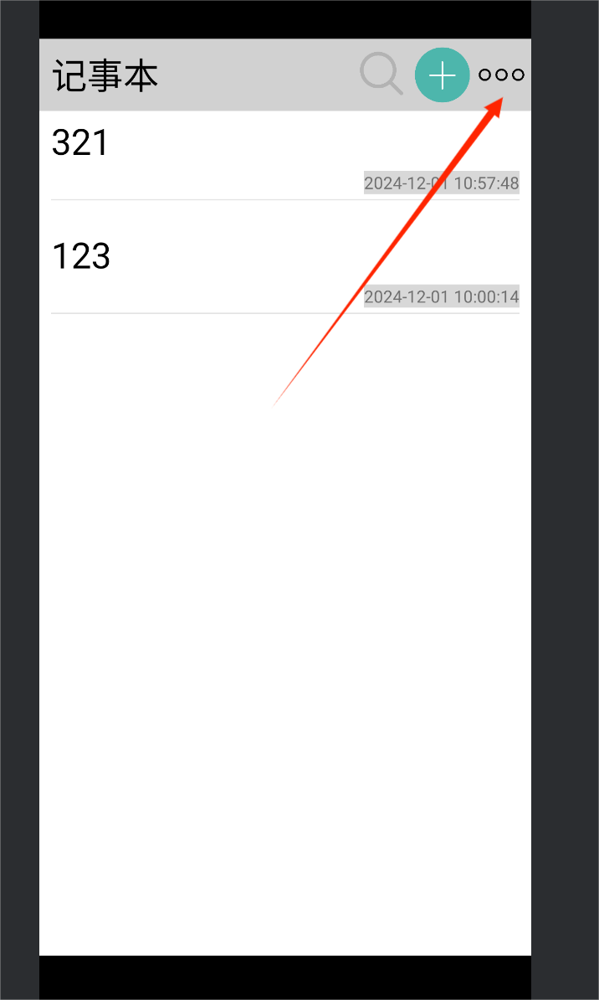
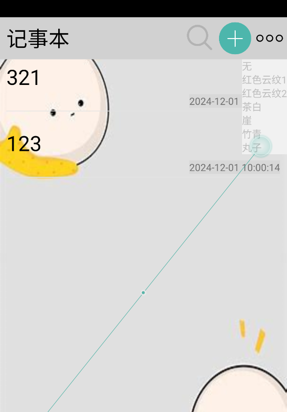
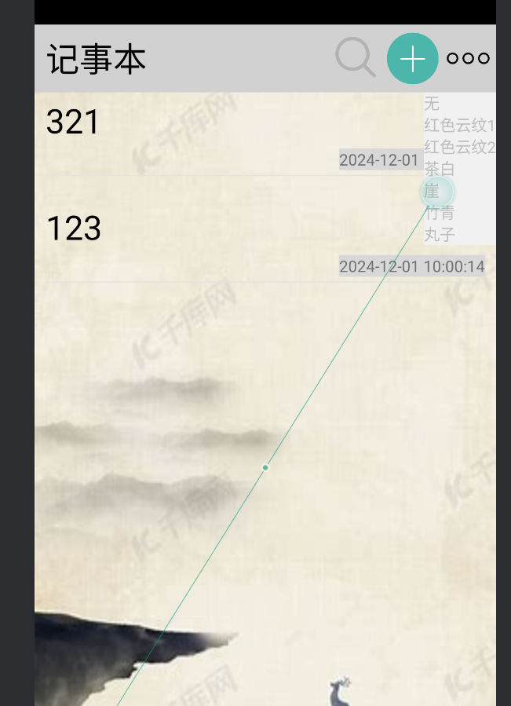
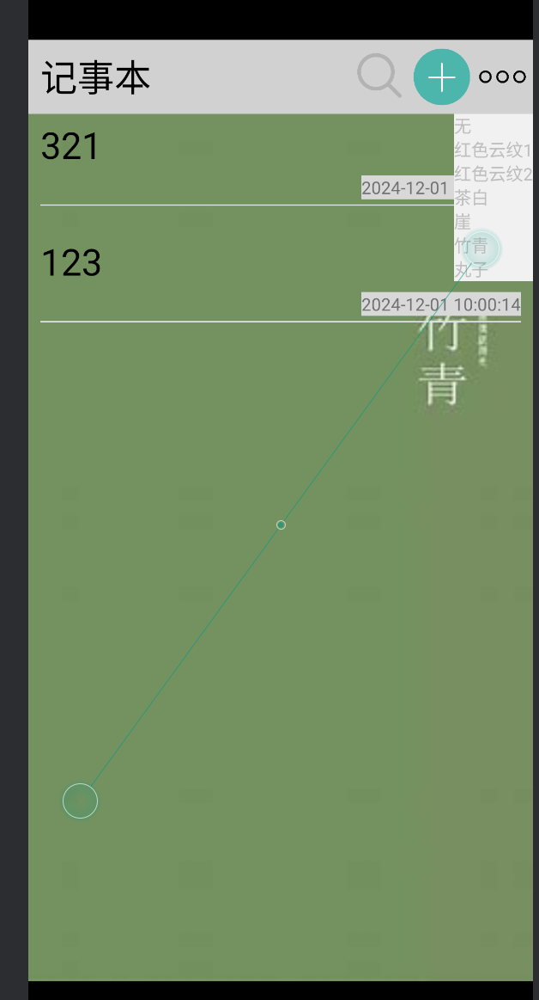

# 字体样式切换

同背景色切换相似，不作过多代码展示

`fontm_menu`中字体菜单设计

```xml
<LinearLayout
                android:layout_width="80dp"
                android:layout_height="100dp"
                android:background="#e1e1e1"
                android:layout_margin="5dp"
                android:orientation="vertical">
```

初始化并展示菜单

```java
        ImageButton fontBtn = (ImageButton) findViewById(R.id.fontBtn);
        fontBtn.setOnClickListener(new View.OnClickListener() {
            @Override
            public void onClick(View view) {
                showFontMenu(view);
            }
        });
```

点击按钮后字体设置为对应的效果，同时隐藏其他按钮的选定图标，这里仅展示一种字体，其余相似不做展示

```java
        popupView.findViewById(R.id.qingniaoBtn).setOnClickListener(new View.OnClickListener() {
            @Override
            public void onClick(View view) {
                TextView textView = (TextView) findViewById(R.id.note);
                Typeface typeface = Typeface.createFromAsset(getAssets(), "font/qingniao.ttf");
                textView.setTypeface(typeface);
                popupView.findViewById(R.id.btn1).setVisibility(View.GONE);
                popupView.findViewById(R.id.btn2).setVisibility(View.GONE);
                popupView.findViewById(R.id.btn3).setVisibility(View.VISIBLE);
                popupView.findViewById(R.id.btn4).setVisibility(View.GONE);
            }
        });
```

在笔记编辑界面可以选择字体样式。

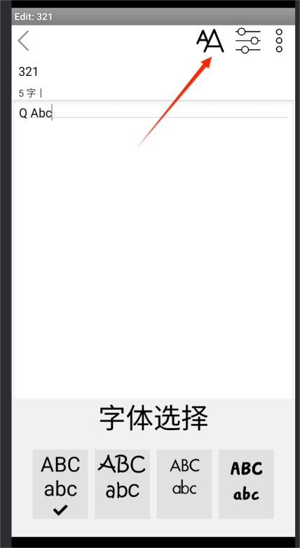
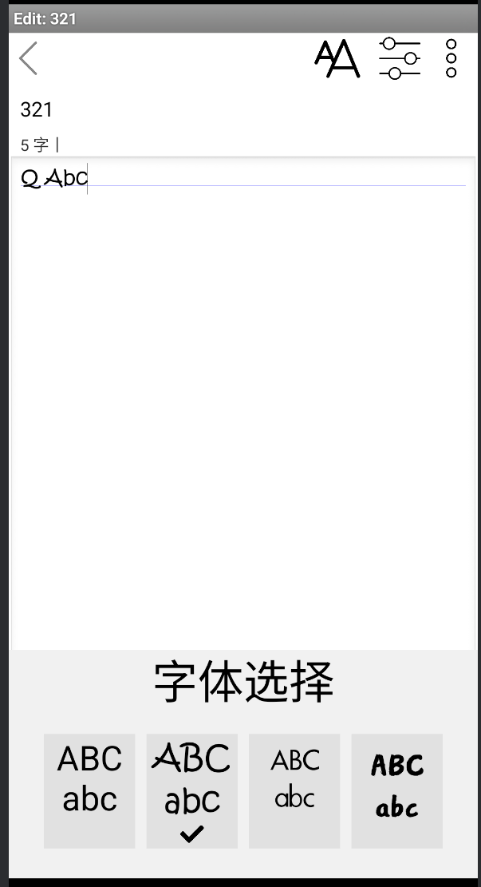
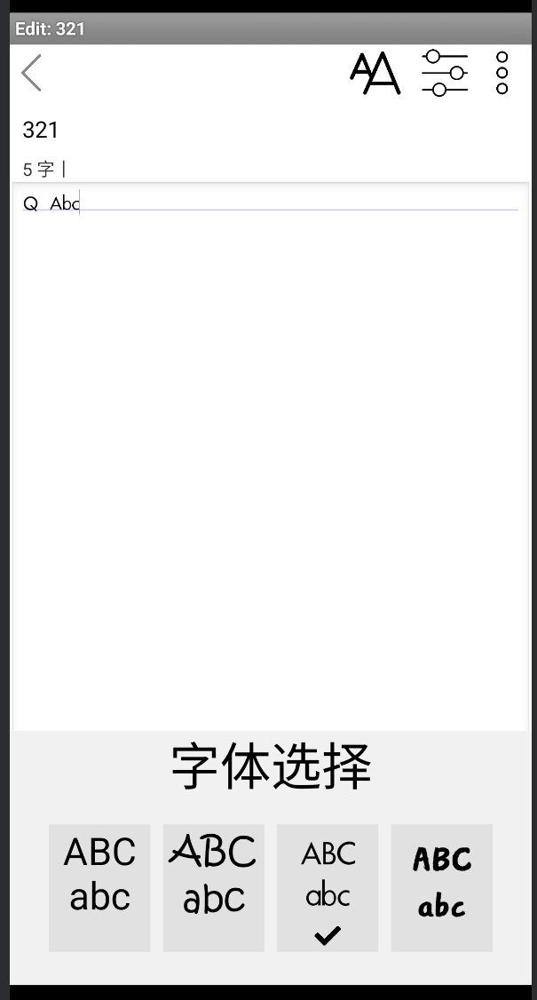
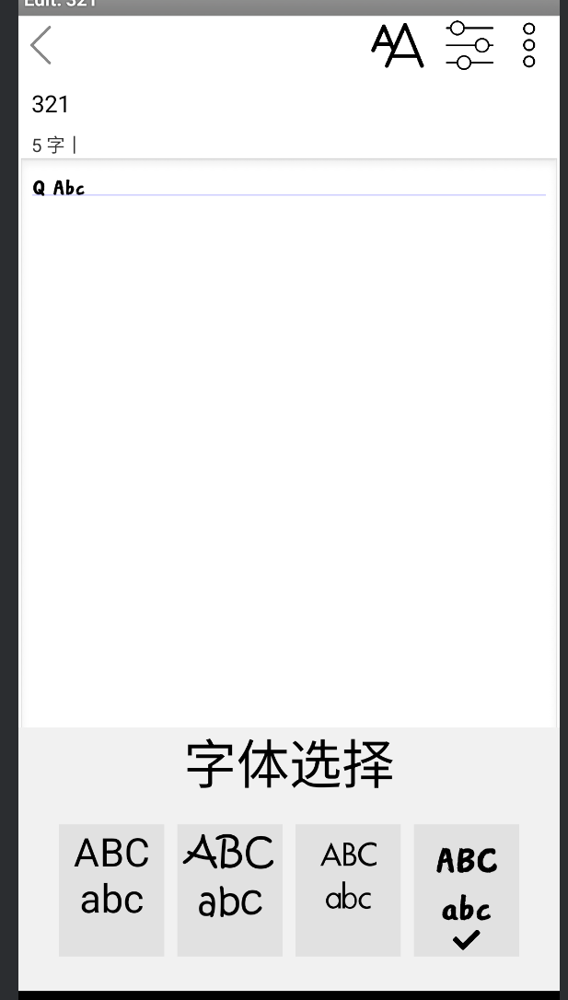

# 字数显示

在`note_editor.xml`中添加字数显示的textview，

```xml
<TextView
                android:id="@+id/length"
                android:layout_width="wrap_content"
                android:layout_marginLeft="10dp"
                android:layout_height="wrap_content"
                android:text="0字丨" />                        
```

在`NoteEditor.java`中初始化组件

```java
            final EditText note =  (EditText) findViewById(R.id.note);
            final TextView length = (TextView) findViewById(R.id.length);
```

完成字数更新功能，当笔记中文本变化的时候，获取`note`的内容并通过`.length()`方法获取字数

```java
// 设置监听器，实时更新字数 
        note.addTextChangedListener(new TextWatcher() {
            @Override
            public void beforeTextChanged(CharSequence charSequence, int start, int count, int after) {
                // 不需要做处理
            }

            @Override
            public void onTextChanged(CharSequence charSequence, int start, int before, int after) {
                // 更新字数
                int charCount = note.getText().length();
                length.setText(charCount + " 字丨");
            }

            @Override
            public void afterTextChanged(Editable editable) {
                // 不需要做处理
            }
        });
```

实时显示该笔记的总字数。

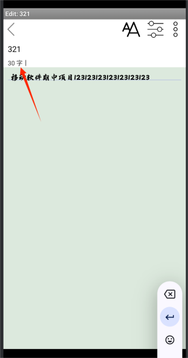

### 笔记导出功能

创建一个`popup_menu.xml`并添加笔记导出的按钮

```xml
    <TextView
        android:id="@+id/exportBtn"
        android:layout_width="match_parent"
        android:layout_height="wrap_content"
        android:padding="12dp"
        android:text="导出"
        android:gravity="center"
        android:background="?android:selectableItemBackground"
        android:textColor="@android:color/black" />
```

点击对应的按钮后展示`popup_menu.xml`

```java
        chooseBtn.setOnClickListener(new View.OnClickListener() {
            @Override
            public void onClick(View view) {
                showChooseMenu(view);
            }
        });
```

加载`popup_menu`，点击导出按钮后调用`export()`方法

```java
    private void showChooseMenu(View anchor) {
        // 加载菜单布局
        View popupView = LayoutInflater.from(this).inflate(R.layout.popup_menu, null);

        // 创建 PopupWindow
        final PopupWindow popupWindow = new PopupWindow(popupView,
                LinearLayout.LayoutParams.WRAP_CONTENT,
                LinearLayout.LayoutParams.WRAP_CONTENT,
                true);

        // 设置点击外部关闭 PopupWindow
        popupWindow.setOutsideTouchable(true);
        popupWindow.setFocusable(true);

        // 找到菜单项并设置点击事件
        TextView menuItem1 = (TextView) popupView.findViewById(R.id.deleteBtn);
        TextView menuItem2 = (TextView) popupView.findViewById(R.id.exportBtn);

        menuItem1.setOnClickListener(new View.OnClickListener() {
            @Override
            public void onClick(View v) {

                deleteNote();
                popupWindow.dismiss(); // 点击后关闭菜单
                finish();
            }
        });

        menuItem2.setOnClickListener(new View.OnClickListener() {
            @Override
            public void onClick(View v) {
                export();
                popupWindow.dismiss(); // 点击后关闭菜单
            }
        });

        // 显示 PopupWindow，位置为按钮下方
        popupWindow.showAsDropDown(anchor, 0, 10, Gravity.END);
    }
```

使用`EditText`动态创建输入框，并进行输入检查，然后通过`openFilePicker(String fileName)`方法启动文件选择器，以便用户选择保存位置并进行文件导出操作。

```java
    private void export() {
        // 创建一个输入框
        final EditText input = new EditText(this);
        input.setHint("请输入文件名");

        // 弹出对话框
        AlertDialog dialog = new AlertDialog.Builder(this)
                .setTitle("导出笔记")
                .setView(input)
                .setPositiveButton("确定", new DialogInterface.OnClickListener() {
                    @Override
                    public void onClick(DialogInterface dialogInterface, int which) {
                        String fileName = input.getText().toString().trim();
                        if (fileName.isEmpty()) {
                            Toast.makeText(NoteEditor.this, "文件名不能为空", Toast.LENGTH_SHORT).show();
                        } else {
                            // 启动文件选择器
                            openFilePicker(fileName);
                        }
                    }
                })
                .setNegativeButton("取消", null)
                .create();
        dialog.show();
        dialog.getButton(AlertDialog.BUTTON_POSITIVE).setTextColor(Color.BLACK);
    }
```

在笔记编辑界面的选项中，可以选择笔记导出功能。

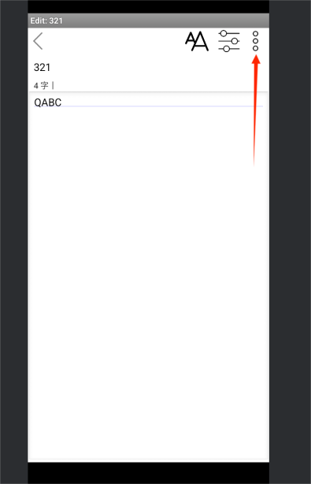
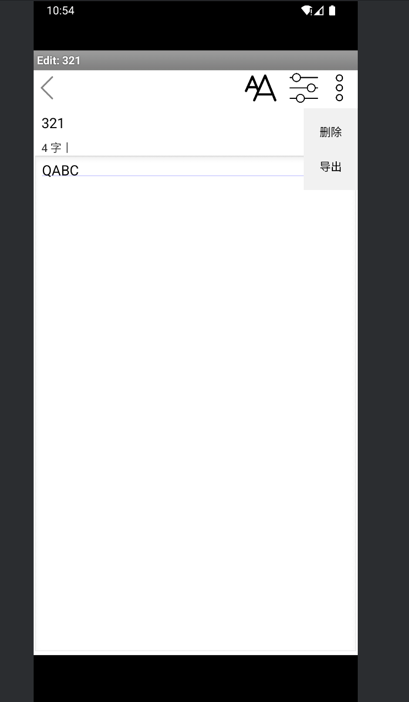
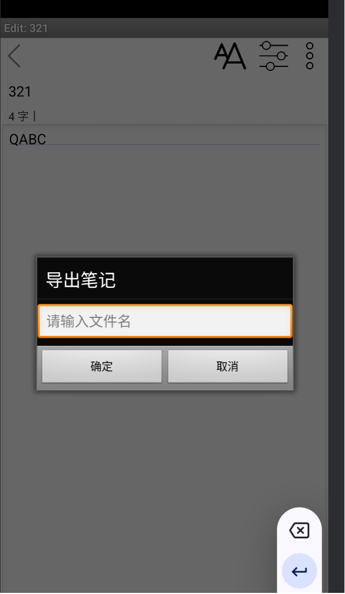

输入文件名后可以选择保存的位置。如果输入为空会出现提示，保存成功后也有提示。

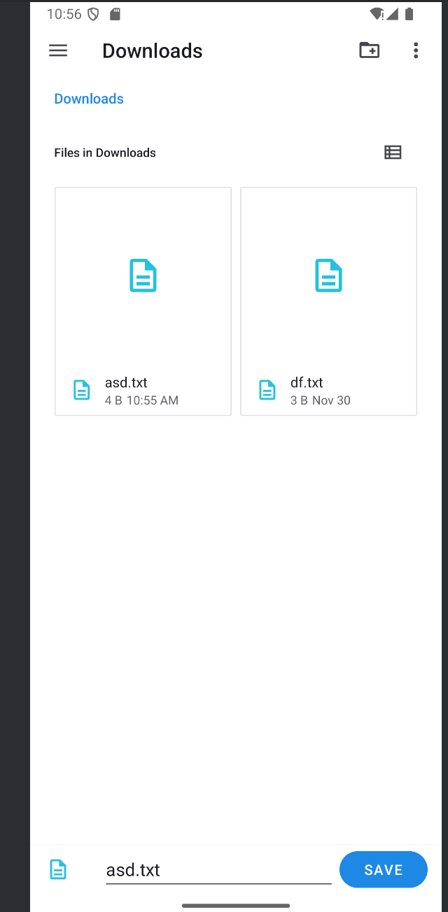
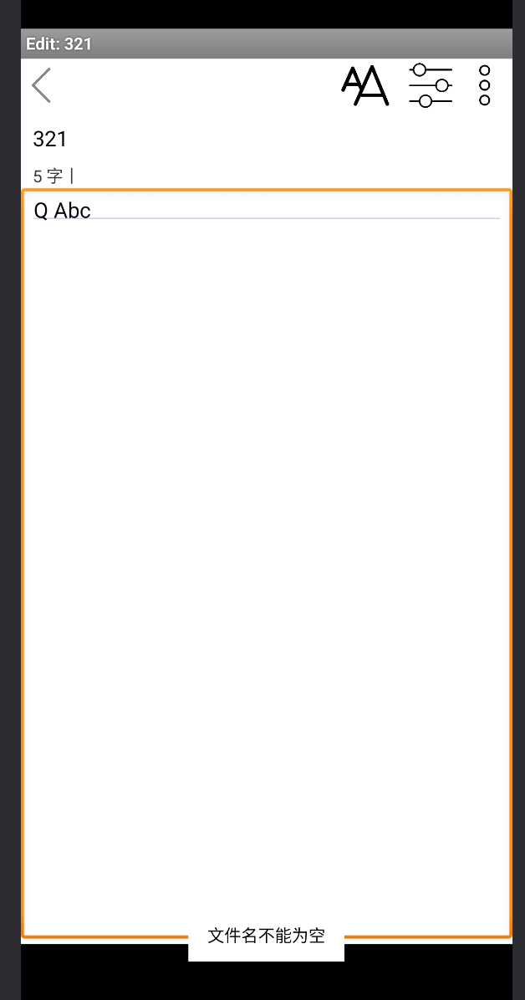
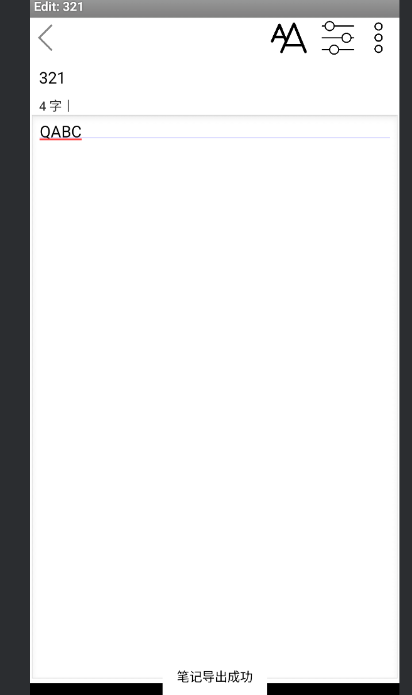


